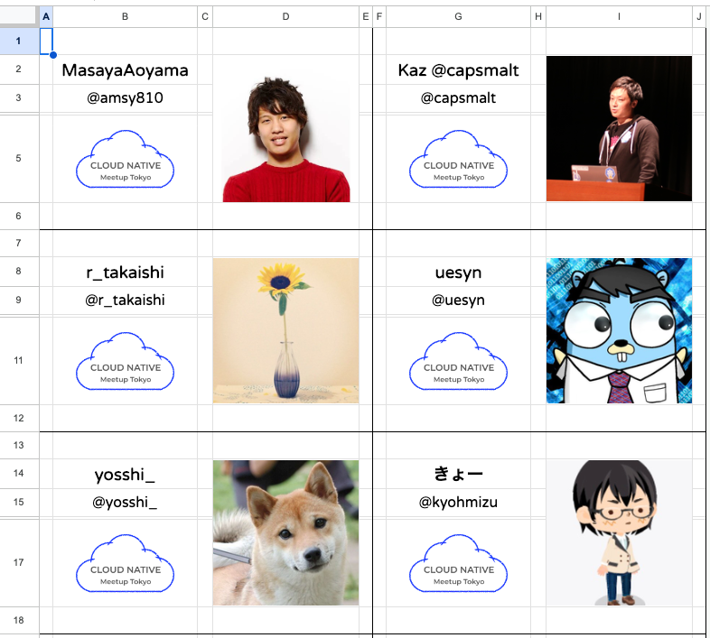

# Connpass Name Tag Generator

[Connpass](https://connpass.com/) のイベント参加者の名札を生成するツール群




# 利用方法

+ Connpass のイベントページ `申込者を管理する` から参加者リストを CSV で取得する
+ `connpass_generate_list.sh` を実行し、`output.csv` を生成する

```bash
bash connpass_generate_list.sh ./event_xxxxxx_participants.csv
```

+ コピーした[スプレッドシート](https://docs.google.com/spreadsheets/d/1H97mKk4GdKG1QfOXUmTIP38sGZ7rmC7n4twQ2T__OEM/edit#gid=267768504) の `参加者リスト` シートに貼り付ける
+ スプレッドシートの `全体設定` シートからイベントロゴなどを設定する
+ スプレッドシートの `印刷用シート` シートを A4 サイズで印刷する

# 作成される名札のサイズ

* TODO: 縦 x cm * 横 x cm 程度
  * 印刷環境によっては誤差が出る可能性があるためご注意ください
* 次回出社時に名札ホルダーのサイズなど測っておきます
